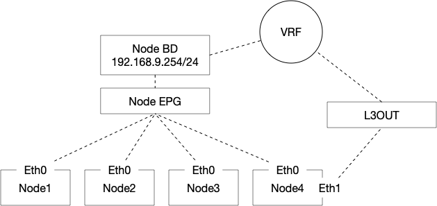

# Cilium Secondary Interface Route Manager

This is a proof of concept application that I am using to test a hybrid L2/L3 design with ACI and Cilium. 
In this design I have a K8s cluster where all the nodes are placed in a single "Node" EPG. 

A subset of nodes are also connected to a L3OUT and are using eBGP to advertise External Services of type `LoadBalancer`
An high level topology is shown here:

This has an issue: If we have 2 interfaces now we need to ensure the traffic is symmetric: The simplest solution for this problem is to add more specific routes for the client subnets pointing to the GW of interface used for Service Graph or BGP Peering but this has several issues:

- Requires potentially adding many static routes manually (Cilium currently doesn’t install routes received via BGP)
- You might need for a specific subnet to be able to access both the primary interface/pod as well as the services

As a more elegant and simpler solution we can use Linux Routing Tables (if you are not familiar this is pretty much adding VRFs to linux) and do the following:

- Add a new routing table say 100
- Add a new default route in the route table 100 pointing to the Service Subnet GW
- Use ip rule to tell linux that if the traffic is source from:
  - The Service Interface IP address or
  - The Service IP Pool
  
  We are going to use route table 100 and so the traffic will be sent back to the Service Subnet GW ensuring routing symmetry

  This can be done manually but is cumbersome to manage especially if you can add/remove nodes dynamically. 

  This small application can be deployed as a DaemonSet (privileged container) and will manage the routing and ip rules for me.

  It accepts the following env variables:

- RT_NUMBER: The Number of the route table to use
- SECONDARY_INTERFACE: The name of the secondary interface
- BGP_SVC_SUBNETS (Optional): A comma separated list of CIDR that needs to match the `CiliumLoadBalancerIPPool` CIDR used for BGP Advertised Routes. 
  - If you use the `start` `stop` syntax in the `CiliumLoadBalancerIPPool` then you need to ensure the CIDR you add here matches/make sense the `start` `stop` range
  - This is optional as this app also support L2 service advertisement over the secondary interface. 
- SECONDARY_GW: IP Address for the secondary GW

To deploy this you can refer to the example [DaemonSet](doc/daemonset.yaml)